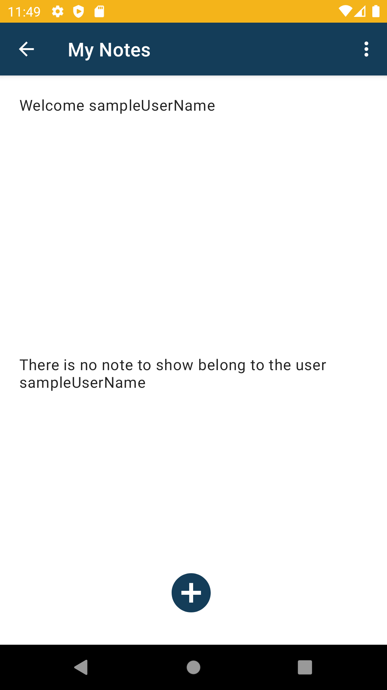

# Simple-Note-App-with-Sqlite

- Simple android note app that contains a two-steps authentication process to create a user. After that, the app allows us to add, delete, update notes belong to that user thanks to the SQLite database. 
 

- It looks like the default note app used on an android device. The app I designed almost presents the same facilities to the user as the default app on Android devices.
 

- The note app also is known you while you're logged in and navigate you to inside the app without the authentication process

 

- The app reminds you when even you logged out and navigates you to login page with yours username and password.

## Visuals from the app

|Visuals From                                                                              | The app                                                                              |
|------------------------------------------------------------------------------------------|---------------------------------------------------------------------------------------------|
|| |
|||
|||
|| |

 
 

 
 

## Usage

- You can install the apk attached to the project to use and explore the app.

- You should register to the app,after that the app will navigate you to the login page with your username and password,you should just login button.Finally,you're logged in. Then you can add note with sign "+". To update,delete note you should click upon the note you wrote.

## Database Er-Diagram

